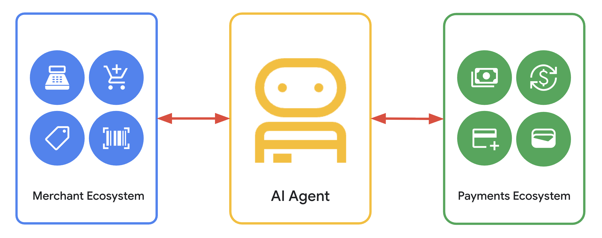

# Agent Payments Protocol (AP2)

[](LICENSE)
[](https://deepwiki.com/google-agentic-commerce/AP2)

<!-- markdownlint-disable MD041 -->
<p align="center">
  
</p>

This repository contains code samples and demos of the Agent Payments Protocol.

## Intro to AP2 Video

[](https://goo.gle/ap2-video)

## About the Samples

These samples use the
[Agent Development Kit (ADK)](https://google.github.io/adk-docs/) and Gemini 2.5
Flash.

The Agent Payments Protocol doesn't require the use of either. While these were
used in the samples, you're free to use any tools you prefer to build your
agents.

## Navigating the Repository

The **samples** directory contains a collection of curated scenarios meant to
demonstrate the key components of the Agent Payments Protocol.

The scenarios can be found in the **samples/android/scenarios** and
**samples/python/scenarios** directories.

Each scenario contains:

*   a README.md file describing the scenario and instructions for running it.
*   a run.sh script to simplify the process of running the scenario locally.

This demonstration features various agents and servers, with most source code
located in **samples/python/src**. Scenarios that use an Android app as the
shopping assistant have their source code in **samples/android**.

## Quickstart

### Prerequisites

*   Python 3.10 or higher

### Setup

Ensure you have obtained a Google API key from
[Google AI Studio](http://aistudio.google.com/apikey). Then declare the
`GOOGLE_API_KEY` variable in one of two ways.

*   Option 1: Declare it as an environment variable: `export
    GOOGLE_API_KEY=your_key`
*   Option 2: Put it into an .env file at the root of your repository. `echo
    "GOOGLE_API_KEY=you_key" > .env`

### How to Run a Scenario

To run a specific scenario, follow the instructions in its README.md. It will
generally follow this pattern:

1.  Navigate to the root of the repository.

    `cd ap2`

1.  Run the run script to install dependencies & start the agents.

    `bash samples/python/scenarios/your-scenario-name/run.sh`

1.  Navigate to the Shopping Agent URL and begin engaging.

### Installing the AP2 Types Package

The protocol's core objects are defined in the [src/ap2/types](src/ap2/types)
directory. A PyPI package will be published at a later time. Until then, you can
install the types package directly using this command:

```
uv pip install git+https://github.com/google-agentic-commerce/AP2.git@main
```
