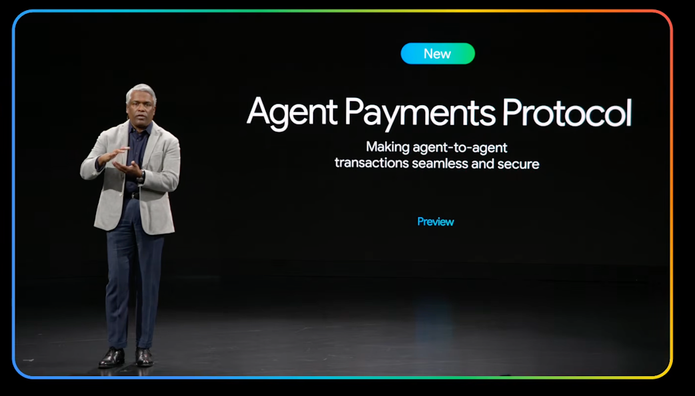
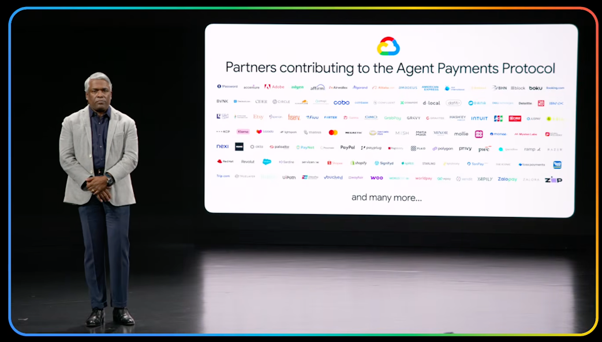

# Partners

Below is a list of partners who are part of the AP2 community and are helping
build, codify, and adopt A2A as the standard protocol for AI agent payments.

> Organizations seeking a partnership with AP2 and inclusion on this page may
> provide details via [this form](https://goo.gle/ap2-partner-form) for
> evaluation.

- [1Password](https://1password.com/)
- [Accenture](https://www.accenture.com/)
- [Adobe](https://www.adobe.com/)
- [Adyen](https://www.adyen.com/)
- [Affirm](https://www.affirm.com/)
- [AirWallex](https://www.airwallex.com/)
- [Algorand](https://www.algorand.com/)
- [Alibaba.com](https://www.alibaba.com/)
- [Amadeus](https://www.amadeus.com/)
- [American Express](https://www.americanexpress.com/)
- [Ant Group](https://www.antgroup.com/en/)
- [BVNK](https://www.bvnk.com/)
- [Binance](https://www.binance.com/)
- [Blackhawk Network](https://blackhawknetwork.com/)
- [Block](https://block.xyz/)
- [Boku](https://www.boku.com/)
- [Booking.com](https://www.booking.com/)
- [CMSPI](https://www.cmspi.com/)
- [Circle](https://www.circle.com/)
- [Cloudflare](https://www.cloudflare.com/)
- [Cobo](https://www.cobo.com/)
- [Coinbase](https://www.coinbase.com/)
- [Confluent](https://www.confluent.io/)
- [Crossmint](https://www.crossmint.com/)
- [DLocal](https://dlocal.com/)
- [Dafiti](https://www.dafiti.com/)
- [Dana](https://www.dana.id/)
- [Dell](https://www.dell.com/)
- [Doku](https://www.doku.com/)
- [Ebanx](https://www.ebanx.com/)
- [EigenLayer](https://www.eigenlayer.xyz/)
- [Ethereum Foundation](https://ethereum.foundation/)
- [Etsy](https://www.etsy.com/)
- [Experian](https://www.experian.com/)
- [Fiserv](https://www.fiserv.com/)
- [Fiuu](https://fiuu.com/)
- [Forter](https://www.forter.com/)
- [GMO Payment Gateway](https://www.gmo-pg.com/)
- [Garena](https://www.garena.com/)
- [Gr4vy](https://gr4vy.com/)
- [GrabPay](https://www.grab.com/)
- [Gravitee](https://www.gravitee.io/)
- [Hashkey](https://www.hashkey.com/)
- [Intuit](https://www.intuit.com/)
- [JCB](https://www.global.jcb/en/)
- [JKOPay](https://www.jkopay.com/)
- [JusPay](https://juspay.in/)
- [KCP (Korea Cyber Payment)](https://kcp.co.kr/)
- [Kaia Network](https://kaia.network/)
- [Klarna](https://www.klarna.com/)
- [Lazada](https://www.lazada.com/)
- [Lightspark](https://www.lightspark.com/)
- [Manus.ai](https://manus.ai/)
- [Mastercard](https://mastercard.com/)
- [MegaEth](https://www.megaeth.com/)
- [Mercado Livre](https://www.mercadolivre.com.br/)
- [Mesh Payments](https://www.meshpayments.com/)
- [MetaMask](https://metamask.io/)
- [Minor Hotels](https://www.minorhotels.com/)
- [Mollie](https://www.mollie.com/)
- [Momo](https://momo.vn/)
- [Monee (ShopeePay)](https://shopeepay.com/)
- [Mysten Labs](https://mystenlabs.com/)
- [Natural Intelligence](https://www.naturalint.com/)
- [Nuvei](https://www.nuvei.com/)
- [Okta](https://www.okta.com/)
- [Palo Alto Networks](https://www.paloaltonetworks.com/)
- [PayPal](https://www.paypal.com/)
- [Paynet](https://www.paynet.ro/)
- [Payoneer](https://www.payoneer.com/)
- [Payplug](https://www.payplug.com/)
- [Ping Identity](https://www.pingidentity.com/)
- [Plaid](https://plaid.com/)
- [Polygon](https://polygon.technology/)
- [Privy](https://www.privy.io/)
- [PwC](https://www.pwc.com/)
- [Ramp](https://ramp.com/)
- [Razer](https://www.razer.com/)
- [Red Hat](https://www.redhat.com/)
- [Revolut](https://www.revolut.com/)
- [Riskified](https://www.riskified.com/)
- [Salesforce](https://www.salesforce.com/)
- [Sardine](https://www.sardine.ai/)
- [Cider](https://www.shopcider.com/)
- [Shopee](https://shopee.com/)
- [Shopify](https://www.shopify.com/)
- [Signifyd](https://www.signifyd.com/)
- [Splitit](https://www.splitit.com/)
- [Synchrony Financial](https://www.synchrony.com/)
- [TenPay](https://global.tenpay.com/)
- [Thales](https://www.thalesgroup.com/)
- [The Iconic](https://www.theiconic.com.au/)
- [Toss](https://toss.im/)
- [Touch n Go](https://www.touchngo.com.my/)
- [Trip.com](https://www.trip.com/)
- [Truelayer](https://www.truelayer.com/)
- [Trulioo](https://www.trulioo.com/)
- [UiPath](https://www.uipath.com/)
- [UnionPay International](https://www.unionpayintl.com/en/)
- [Vouched](https://vouched.id/)
- [WPay](https://www.wpay.com.au/)
- [Wayfair](https://www.wayfair.com/)
- [WooCommerce](https://woocommerce.com/)
- [Worldline](https://worldline.com/)
- [Worldpay](https://www.fisglobal.com/en/products/worldpay)
- [Xendit](https://www.xendit.co/)
- [Yapily](https://www.yapily.com/)
- [ZIP](https://zip.co/)
- [Zalopay](https://zalopay.vn/)
- [Zalora](https://www.zalora.com/)

Many AP2 partners were featured in the keynote at Google's
[Gemini at Work](https://www.googlecloudevents.com/gemini-at-work) on Oct 9th, 2025.

