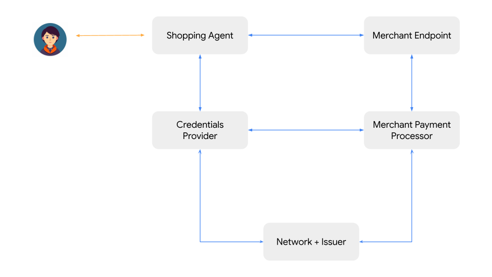
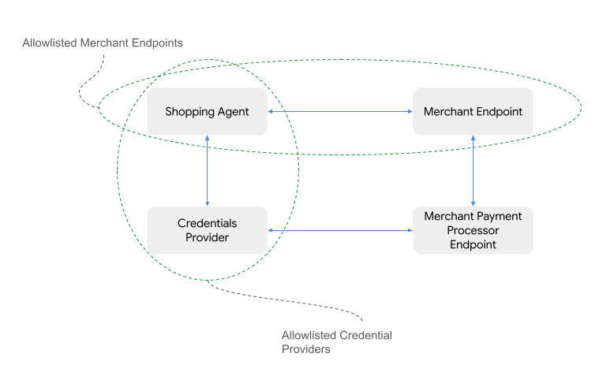
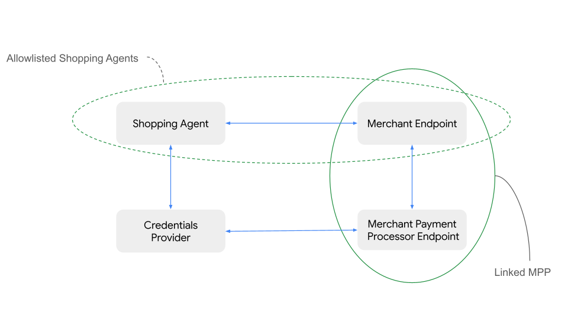
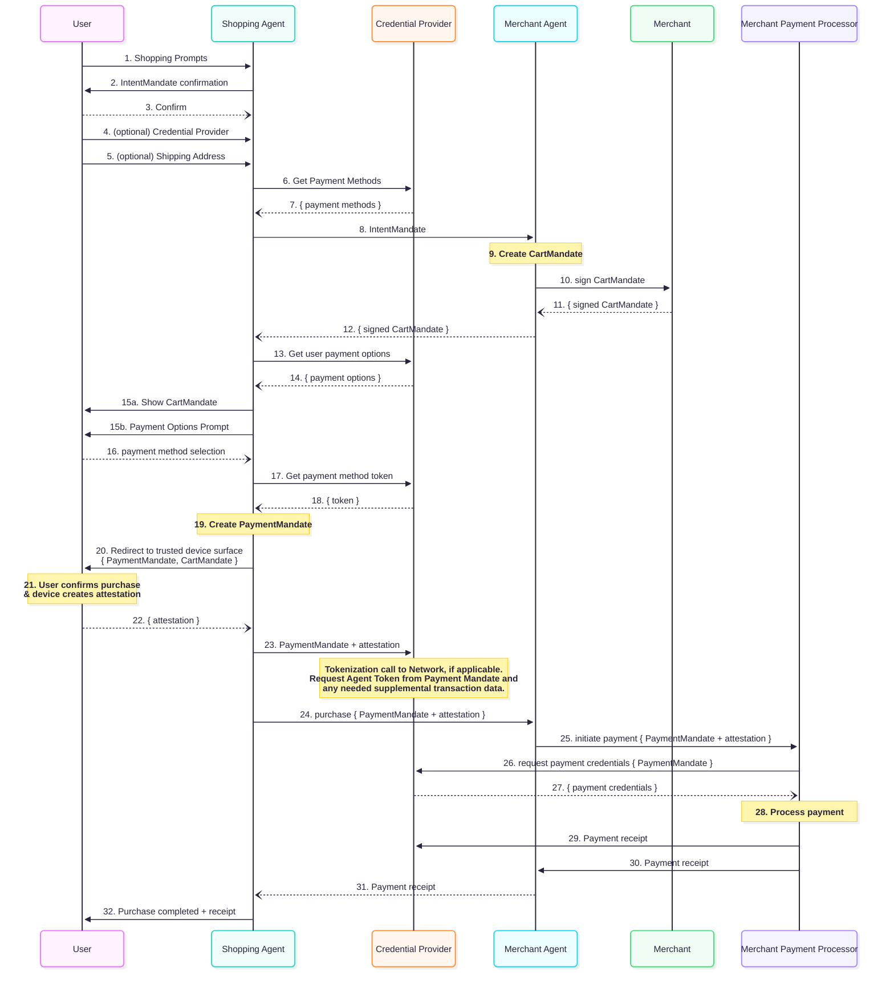

# Agent Payments Protocol (AP2): Building a Secure and Interoperable Future for AI-Driven Payments

## Executive Summary

AI agents will redefine the landscape of digital commerce, promising
unprecedented convenience, personalization, and efficiency. However, this shift
exposes a fundamental challenge: the world's existing payments infrastructure
was not designed for a future where autonomous, non-human agents act on a user's
behalf, or transact with each other. Current payment protocols, built on the
assumption of direct human initiated interaction with trusted interfaces, lack
the mechanisms to securely validate an agent's authenticity and authority to
transact. This exposes a long-standing defense against online fraud, creates
ambiguity around transaction liability, and threatens adoption, not only of
agent commerce, but also negatively impacts existing digital commerce.

Without a common, trusted protocol, the industry faces the prospect of a
fragmented and insecure ecosystem, characterized by proprietary, siloed
solutions that increase complexity for merchants, create friction for users, and
prevent financial institutions from uniformly assessing risk. To address this
gap, this protocol proposes an open, interoperable protocol for agent payments.
This protocol, designed as an extension for emerging agent-to-agent (A2A) and
model-context protocols (MCP), establishes a secure and reliable framework for
AI-driven commerce.

## An Invitation to Collaborate: Roadmap and Community Engagement

The success of this foundational protocol for agent payments depends on broad
industry participation, feedback, and public support. We invite all stakeholders
in the commerce and payments ecosystem to join in refining and building this
open protocol.

### Proposed Roadmap

The development and rollout of the protocol are envisioned in a phased approach,
allowing the ecosystem to build, test, and adopt capabilities incrementally.

- **V0.1**: The initial specification focuses on establishing the core
    architecture and enabling the most common use cases. Key features include:
    - Support for "pull" payment methods (e.g., credit/debit cards)
    - Well-defined data payloads to support transparent accountability based
        on the VDC framework
    - Support for human-present scenarios
    - Support for user and merchant-initiated step-up challenges
    - Detailed sequence diagram and reference implementation using
        [A2A protocol](https://a2a-protocol.org/)
- **V1.x**: Subsequent versions will expand the protocol's capabilities based
    on community feedback and evolving needs. Potential areas of focus include:
    - Full support for "push" payments and all payment methods (e.g.,
        real-time bank transfers, e-wallets etc.)
    - Standardized flows for recurring payments and subscriptions
    - Support for human-not-present scenarios
    - Detailed sequence diagrams for MCP-based implementations
- **Long-Term Vision**: Longer term, we plan the protocol to incorporate more
    intelligence and flexibility, including:
    - Native support for complex, multi-merchant transaction topologies
    - Support for real-time negotiations between buyer and seller agents

We believe that a collaborative approach is essential to creating a protocol
that is robust, secure, and meets the diverse needs of the entire ecosystem. We
actively seek feedback and critique on the github repository through issues and
discussions.

## Section 1: The New Frontier of Commerce: Why Agent Payments Require a Foundational Protocol

### 1.1 The Rise of Agent Commerce

The evolution of digital interaction is entering a new phase, moving beyond
direct manipulation of UIs to conversational and delegated task execution. AI
agents are rapidly becoming primary actors, capable of understanding complex
user requests and executing multistep tasks autonomously. In commerce, this
translates into a paradigm shift where agents will manage everything from
routine purchases and subscription management to complex product research, price
negotiation, and dynamic order bundling across multiple vendors. This new era of
agent commerce promises to unlock immense value, offering users a
hyper-personalized and frictionless shopping experience while providing
merchants with new, intelligent channels to reach and serve customers.

### 1.2 The Foundational Gap: A Crisis of Trust and Liability

Despite its promise, the rise of agent commerce exposes a critical vulnerability
in the existing digital payments infrastructure. Today's payment protocols are
designed around the principle of a human user directly interacting with a
trusted interface, such as a merchant's website or a payment provider's app.
Authentication, authorization, and liability are all predicated on this direct
human involvement.

Autonomous agents shatter this assumption. When an agent initiates a payment,
fundamental questions arise that current systems are ill-equipped to answer:

- Authorization & Auditability: What verifiable proof demonstrates that the
    user granted the agent the specific authority to make this particular
    purchase?
- Authenticity of Intent: How can a merchant or payment processor be certain
    that the agent's request accurately reflects the human user's true intent?
- Agent Error and "Hallucination": How does the system protect against agent
    errors, such as misinterpreting a user's request or "hallucinating" product
    details, which could lead to incorrect purchases?
- Accountability: In the event of a fraudulent or erroneous transaction, who
    is accountable? The user who delegated the task? The developer of the
    shopping agent? The merchant who accepted the order? Or the payment network
    that processed it?

This ambiguity creates a crisis of trust. Without a robust framework to validate
agent authority and assign liability clearly, financial institutions may be
hesitant to approve agent-initiated transactions, merchants will be exposed to
unacceptable levels of fraud risk, and users will be reluctant to delegate
financial authority to agents.

### 1.3 The Risk of a Fragmented Ecosystem

In the absence of a universally adopted protocol, the industry will inevitably
move toward a patchwork of proprietary, closed-loop solutions. Large retailers
might develop bespoke integrations for their specific agents, and payment
providers might create siloed ecosystems that do not interoperate. This
fragmentation would have severe negative consequences:

- For Users: A confusing and inconsistent experience, where their preferred
    agent may only work with a limited set of merchants or payment methods.
- For Merchants: High development and maintenance costs to support multiple,
    non-standard agent payment integrations, creating a significant barrier to
    entry for small and medium-sized businesses.
- For the Payments Ecosystem: An inability to collect common signals across
    all agent transactions in order to consistently mitigate fraud, leading to
    higher costs and suppressed transaction approval rates.

An open, interoperable protocol is the most viable path forward. It creates a
common language for all participants. It allows for additional data points to be
shared about the transaction in a way that wasn’t possible before and ensures
that any compliant agent can securely transact with any compliant merchant,
fostering a competitive and innovative marketplace.

## Section 2: Guiding Principles for a Trusted Agent Economy

The design of this proposed protocol is rooted in a set of core principles
intended to build a sustainable, secure, and equitable ecosystem for all
participants. These principles serve as the philosophical foundation for the
technical architecture that follows.

### 2.1 Openness and Interoperability

This protocol is proposed as a non-proprietary, open extension for existing and
future agent-to-agent (A2A) and model-context protocol (MCP). The goal is to
provide a common, interoperable payments layer that can be adopted by any
ecosystem player. This approach fosters a healthy, competitive environment where
developers can innovate on agent capabilities, merchants can reach the broadest
possible audience, and users can choose the combination of agents and services
that best suits their needs.

### 2.2 User Control and Privacy by Design

The user must always be the ultimate authority. The protocol is designed to
ensure users have granular control and transparent visibility over their agents'
activities.

Privacy is a core design tenet. The protocol is designed to protect sensitive
user information, including the content of their conversational prompts and
personal payment details. Through payload encryption and a role-based
architecture, agents involved in the shopping process are prevented from
accessing sensitive payment card industry (PCI) data or other personally
identifiable information (PII), which is handled exclusively by the specialized
entities and the secure elements of the payment infrastructure.

### 2.3 Verifiable Intent, Not Inferred Action

Trust in an AI Agent system cannot be based only on interpreting the ambiguous,
probabilistic outputs of a large language model. Transactions must be anchored
to deterministic, non-repudiable proof of intent from all parties. This
principle directly addresses the risk of agent "hallucination" and
misinterpretation.

### 2.4 Clear Transaction Accountability

For the payments ecosystem to embrace agent commerce, there can be no ambiguity
regarding transaction accountability. A primary objective of this protocol is to
provide supporting evidence that helps payment networks establish accountability
and liability principles. This clarity is table stakes for gaining the
confidence and participation of merchants, issuers, and payment networks.

## Section 3: Architectural Overview: A Role-Based Ecosystem for Secure Transactions

To achieve its goals of security, interoperability, and clear accountability,
the proposed protocol defines a role-based architecture. Each actor in the
ecosystem has a distinct and well-defined set of responsibilities, ensuring a
separation of concerns that enhances security and simplifies integration.

### 3.1 The Actors

The agent payments ecosystem consists of the following key roles:

- **The User**: The human individual who initiates a commerce task by
    delegating it to their Agent. The User is the ultimate source of intent and
    financial authority.
- **The User Agent (UA) or Shopping Agent (SA)** : This is the AI Surface that
    the user directly interacts with. The User Agent (UA) may delegate the
    commerce task to another AI Agent (say, the Shopping Agent or “SA”). Its
    primary functions include understanding the user's needs, discovering
    products, interacting with merchants to build a cart, and obtaining the
    user's signed authorization to initiate a payment related task.
- **The User’s Credentials Provider (CP)**: A specialized entity responsible
    for the secure management and execution of payments credentials (e.g. a
    digital Wallet). It holds knowledge of the User's available payment methods,
    gets user consent (if deemed necessary) to share credentials with the SA,
    selects the optimal payment method based on user preferences and transaction
    context, and handles payment scenarios like errors, declines and transaction
    challenges gracefully.
- **The Remote or Merchant Endpoint (ME)**: A web interface, MCP endpoint or
    an AI agent operating on behalf of an entity which expects to receive a
    payment in return for offering products or services. Its objectives are to
    showcase products/services, provide information, negotiate the contents of a
    cart with a Shopping Agent, and confirm that it has enough information about
    the user’s intent to deliver the right products/services.
- **The Merchant Payment Processor Endpoint (MPP)**: The Merchant Payment
    Processor (web, API, MCP or AI Agent) may be the same as the Merchant if the
    Merchant has all the capabilities to fulfill this role. The MPP constructs
    the txn auth message which can be sent to the payment ecosystem for
    authorization.
- **Network and Issuer**: The provider of the payment network and issuer of
    payment credentials to the human user. The Credentials Provider may need to
    interact with the network for issuance of specific tokens for AI agent
    transactions and the Merchant/PSP may submit these transactions for
    authorization to issuers via the networks.



### 3.2 The Flow of Trust

#### 3.2.1 Short Term

In the immediate future, payment ecosystem trust will be established through
manually curated allow lists of approved agents.

- The Shopping Agent may choose to work with a trusted registry of Credential
    Providers
- The Credential Provider may choose to work with a trusted registry of
    Shopping Agents
- The Shopping Agent will define which merchants it can safely support. This
    may be through pre-established integrations or real-time discovery via
    web-crawling or other agentic capabilities. Inversely, merchants may also
    have a trust registry of Shopping Agents.

These registries are decentralized and manually curated by the entity owners
(_e.g. Shopping Agent provider decides that they want to allowlist limited
popular credentials providers but not any others_). This is less work than the
industry current approach of point-to-point integrations where there is
development work required for every bespoke integration.





#### 3.2.2 Long Term

In the long term, we anticipate that both MCP and A2A protocols will incorporate
additional methods for asserting the identities of both the Agent and the User
it represents. This will enable Merchant or Shopping Agents to identify a
Credentials Provider and facilitate the real-time establishment of trust between
them. Consequently, the Credentials Provider can verify that a Shopping Agent is
operating on behalf of <johndoe@gmail.com>, and that a specific merchant
endpoint is genuinely representing a real merchant. Similarly, the Credentials
Provider should be trusted by the Shopping Agent & Merchant Endpoint to be
authentic and to appropriately represent <johndoe@gmail.com>. This trust
framework will leverage and extend established web standards such as HTTPS, DNS
ownership, mTLS, and API key-exchange.

## Section 4: Trust Anchors: Verifiable Digital Credentials & Mandates

The central innovation of this protocol is the mechanism by which it engineers
trust into a distributed and potentially adversarial environment. This is
accomplished through the interplay of a set of standardized, cryptographically
secure data objects known as verifiable digital credentials (VDCs).

### 4.1 The Language of Trust: Verifiable Digital Credentials (VDCs)

Verifiable digital credentials are the standardized data structures used to convey
trusted information between agents. They are tamper-evident, non-disputable,
portable, and cryptographically signed digital objects that serve as the
building blocks of a transaction. The primary VDCs in this framework are the Cart
Mandate, the Intent Mandate and the Payment Mandate.

#### 4.1.1 The Cart Mandate

The Cart Mandate is the foundational credential that captures the user's
authorization for a purchase when the human is present at the time of purchase
([see illustrative user journey](#51-human-present-transaction)). It is
generated by the Merchant based on the user's request and is cryptographically
signed by the user, typically using a hardware-backed key on their device with
in-session authentication. This signature binds the user's identity and
authorization to their intent. The Cart Mandate is a structured object
containing critical parameters that define the scope of the transaction.

A Cart Mandate contains the following bound information:

- Payer and Payee Information: Verifiable identities for the user, the
    merchant, and their respective Credential Providers.
- Payment Method: A tokenized representation of the single, specific payment
    method to be charged, as selected by the Credentials Provider and confirmed
    by the user.
- Risk Payload: A container for risk-related signals required by merchants,
    payment processors and issuers
- Transaction Details: The final, exact transaction products, destination
    (email or physical address), amount and currency.
- If applicable, the conditions under which the purchase can be refundable

#### 4.1.2 The Intent Mandate

The Intent Mandate is a separate verifiable digital credential which is critical for
scenarios where the human is not present at actual transaction time
([see how this plugs into the “human not present” journey](#52-human-not-present-transaction)).
It serves as the final, non-repudiable authorization to execute a purchase in
the user’s absence. It is generated by the Shopping Agent based on the user's
request and is cryptographically signed by the user, typically using a
hardware-backed key on their device.

An Intent Mandate may contain the following bound information (_not that some of
it may vary depending on human-present and human-not-present scenario_):

- Payer and Payee Information: Verifiable identities for the user, the
    merchant, and their respective Credential Providers.
- Chargeable Payment Methods: A list or category of payment methods the user
    has authorized for the transaction.
- Risk Payload: A container for risk-related signals required by merchants,
    payment processors and issuers
- Shopping Intent: Parameters defining the purchase, such as product
    categories, or specific SKUs and relevant purchase decision criteria like
    refundability.
- Prompt Playback: The Agent’s understanding of the User’s prompt in natural
    language.
- Time-to-Live (TTL): An expiration time for the mandate's validity.

#### 4.1.3 The Payment Mandate for AI Agent Visibility to Payments Ecosystem

While the Cart and Intent mandates are required by the merchant to fulfill the
order, separately the protocol provides additional visibility into the agentic
transaction to the payments ecosystem. For this purpose, a verifiable digital credential
“PaymentMandate” (_bound to Cart/Intent mandate but containing separate
information_) may be shared with the network/issuer along with the standard
transaction authorization messages. The PaymentMandate’s goal is to help the
network/issuer build trust into the agentic transaction and it contains the
below information.

- AI Agent presence and transaction modality (Human Present v/s Not Present)
    signals must always be shared
- With user consent, the issuer and/or network may contractually enforce rules
    which require the sharing of additional information present in Cart and/or
    Intent Mandates for purposes such as fraud prevention.
- At time of disputes, merchants may use the full cart and/or intent mandates
    as evidence during representment with the network/issuer as defined by
    network rules.

This architecture represents a significant evolution from traditional,
imperative API calls (e.g., `create_order`) to a model of "contractual
conversation." The protocol messages are not simply commands; they are steps in
a formal, auditable negotiation that culminates in a binding digital contract.
This declarative, consensus-driven model is inherently more secure and robust
for the complex, multi-party interactions that will define the agentic era,
providing a far stronger foundation for trust and dispute resolution than any
client-server API model can offer and paves the way for future security
enhancements like Digital Payment Credentials and other cryptographic
approaches.

## Section 5: Core User Journeys

### 5.1 Human Present Transaction

Human delegates a task to an AI Agent which requires a payment to be made (say,
shopping) and human is available when the payment has to be authorized. A
typical (but not only) way this may happen is as below:

- Setup: The User may set up a connection between their preferred Shopping
    Agent & any of the supported Credential Providers. This may require the User
    to authenticate themselves on a surface owned by the Credential Provider.

- Discovery & Negotiation: The User provides a shopping task to their chosen
    AI Agent (_which may activate a specialized Shopping Agent to complete the
    task_). The Shopping Agent interacts with one or more Merchants to assemble
    a cart that satisfies the User's request. This may include the ability for
    the merchant to provide loyalty, offers, cross-sell and up-sell information
    (_via the integration between the Shopping Agent & Merchant_) which the
    Shopping Agent should represent to the user .

- Merchant Validates Cart: A SKU or set of SKUs are authorized by the User for
    purchase. This is communicated by the Shopping Agent to the Merchant to
    initiate order creation. The Merchant must sign the Cart that they create
    for a user, signaling that they will fulfill this cart.

- Provide Payment Methods: The Shopping Agent may provide the payment context
    to the Credentials Provider and request an applicable payment method (shared
    as a reference or in encrypted form), along with any loyalty/discount
    information which may be relevant for the payment method selection (_say,
    card points which can be redeemed towards the txn_).

- Show Cart: The Shopping Agent presents the final cart and applicable payment
    method to the user in a trusted surface and the user can approve it via an
    authentication process.

- Sign & Pay: The user’s signed approval must create a cryptographically
    signed “Cart Mandate”. This mandate contains the explicit goods being
    purchased & their confirmation of purchase. It is shared with the Merchant
    so they can use this as evidence in case of disputes. Separately, the
    PaymentMandate (_containing agent involvement & Human-Present signals_) may
    be shared with the network & issuer for transaction authorization.

- Payment Execution: The payment subset of the “Cart Mandate” must be conveyed
    to the Credential provider and Merchant to complete the transaction. There
    may be multiple ways this might happen. For example,

    - The Shopping Agent (SA) may request Credentials Provider to complete a
        payment with the Merchant OR,
    - the SA may submit an order with the merchant, triggering a payment
        authorization flow where the merchant/PSP requests payment method from
        the Credentials Provider.

- Send Transaction to Issuer: The Merchant or PSP routes the transaction to
    the issuer or the network within which the payment method operates. The
    transaction packet may be appended with AI agent presence signals ensuring
    network/issuer get visibility into agentic transactions.

- Challenge: Any party (issuer, credential provider, merchant etc.) may choose
    to challenge the transaction through existing mechanisms like 3DS2. This
    challenge needs to be presented to the user by the User Agent (_an example
    of this would be a hosted 3DS_) and may require a redirect to a trusted
    surface to complete.

- Resolve Challenge: The user should have a way to resolve the challenge on a
    trusted surface (say, banking app, website etc.)

- Authorize Transaction: The issuer approves the payment and confirms success
    back. This is communicated to the User and the Merchant so that the order
    can be fulfilled. A payment receipt is shared with the Credential Provider
    confirming the transaction result. In case of a decline, that can also be
    appropriately communicated.

### 5.2 Human Not Present Transaction

Human delegates a task to an AI Agent which requires a payment to be made (say,
shopping) and human wants the AI Agent to proceed with the payment in their
absence. Some canonical scenarios here could be “_buy these shoes for me when
the price drops below $100_” or “_buy 2 tickets to this concert as soon as they
become available, make sure we’re close to the main stage but don’t spend more
than $1000_”.

Key changes from the Human Present modality are noted below:

1. “Cart Prompt Not Required”: The Agent must repeat back to the User what they
   think they are expected to purchase. The User must approve this and confirm
   that they would like the agent to proceed with the purchase in their absence.
   This is done by the User going through in-session authentication (biometric
   etc.) to confirm their intent.

2. “Intent Mandate” is signed by the user instead of the “Cart Mandate” in
   “Human Not Present” scenarios. “Intent Mandate” includes the natural language
   description of the user’s intent as understood by the AI Agent. This is
   signed by the user and shared with the Merchant so they can decide if they
   are able to fulfill the user’s requirement.

3. Merchant can force user confirmation: If the Merchant is unsure about their
   ability to fulfill the user’s needs, they can force the user to come back
   into session to confirm. Here, the merchant can require either (i) the user
   select from among a set of SKUs presented to them or (ii) provide answers to
   additional questions that the merchant needs to know. (i) can lead to
   creation of Human-Present cart mandate and (ii) can lead to updating the
   “intent mandate” with more information. This ensures that the Merchants get
   more confidence on the user’s intent if they are unsure. Merchants may
   balance transaction conversion rates with returns/user dissatisfaction to
   decide when they want to force users to provide additional confirmation.

Example Scenario

- User says to SA: "Buy 2 tickets to _\<this concert\>_ from _\<this
    merchant\>_ as soon as they become available for the Vegas show in July.
    Your budget is $1000 and we’d like to be as close to the main stage as
    possible"
- User signs this as an Intent Mandate allowing the SA to purchase in the
    user’s absence.
- Merchant receives this intent mandate and then they can say "I have 3
    variations of seating which fulfill this criteria and I don’t know which one
    the user wants. The intent mandate is not sufficient for me to fulfill this
    order".
- The merchant can respond to the SA and say that I want to show the user the
    final 3 options.
- SA notifies the user that their presence is needed before the txn can be
    initiated. User sees the 3 options, picks one and can now sign a "Cart
    Mandate" which gives the merchant evidence that the user knows exactly what
    they are getting.

Alternatively, the merchant may have decided to fulfill the order with the
cheapest tickets which meet the criteria. This would be up to the merchant and
they can decide when they want to bring the user back into session and when they
are able to fulfill the order without bringing the user back.

### 5.3 Payment Method Addition

Depending on their risk appetite, merchants should have the ability to require a
minimum level of security associated with the payment method if it’s going to be
accepted for an agentic transaction. Payment networks may also define security
or tokenization requirements for agentic transactions which should be enforced
by the merchant before a transaction can be initiated.

If the User initiates a purchase request with a Shopping Agent without having
any eligible payment methods with their Credentials Provider, the CP should be
able to provide instruction to the User via the Shopping Agent on setting up a
payment method and making it ready for agentic transactions. This may require a
tokenization flow which the user may have to perform on a trusted Payments
surface owned by the Credentials Provider or the network/issuer.

### 5.4 Payment Method Selection

The merchant will define what payment methods they accept and the associated
fees. If applicable, the merchant will also declare what processor they use. If
the payment method is a push payment method, the merchant will define where to
push funds to. Once in the context of a cart, the merchant can define the subset
of supported payment methods.

The merchant can also declare that they already have user payment methods stored
“on file” in which case the Shopping Agent may not need to use a Credentials
Provider.

The Credentials Provider knows what payment methods the user has available. The
Shopping Agent will be able to inquire about the user’s payment methods to
ensure that the user payment methods are compatible with the Merchant’s accepted
payment methods.

### 5.5 Transaction Challenges

Any player in the ecosystem can require a user challenge during a payment flow.
For v0.1, this will be a redirect challenge passed back to the Shopping Agent to
surface to the User. The User will be redirected to a trusted surface to
complete the challenge. This will allow for current user challenges like 3DS2,
or OTPs to be used as challenges for agentic transactions.

The Credential Provider should be aware when a challenge is performed, so that
the information of a successful challenge-type can be passed to the relevant
entities (merchants & issuers) ensuring the user is not challenged twice if the
issuer or merchant already trusts the completed challenges. For the “Human Not
Present” scenario, a transaction challenge will force the user to come into
session. All existing risk systems that merchants, networks & issuers have
instituted, should still be able to reason over the data they are receiving and
identify when the challenges are needed, ensuring backward compatibility.

## Section 6: Enabling Dispute Resolution

A clear and predictable framework for handling disputed transactions is
paramount for the adoption of any new payment protocol by financial
institutions, merchants, and users. This protocol is designed to provide a
certified, evidence-based system for assigning accountability.

### Core Principles

The foundational principles are that accountability should

1. Stay similar to existing regulations and processes as much as possible,
   innovate only where needed
2. Follow verifiable proof using the cryptographic chain of evidence which
   creates a non-repudiable audit trail
3. Land on a real-world entity (user, merchant or issuer) for the vast majority
   of cases and only land on an AI Agent if a load bearing decision made by the
   AI Agent is determined to be wrong (such as, Agent Account Takeover leading
   to purchases on behalf of a good user by a fraudster).

In the event of a dispute, the network adjudicator (Card Network, e-Wallet
provider, govt agency etc.) can receive additional information from the
Merchant, including the cart, hash, and cart/intent mandate along with the
evidence which they already collect. The adjudicator can then make a decision on
whether the user approved the final cart and the merchant delivered what the
user requested.

This process is consciously kept similar to existing dispute flows, especially
in the Card network, allowing merchants to plug in additional evidence which
supports them in disputes allowing them to participate in agentic transactions
with confidence.

The following table outlines how liability could be allocated in several common
failure scenarios, based on the evidence available within the protocol. Note
that every payment network will define its own liability contracts and so this
table only provides a helpful guide, not a binding contract of any kind.

Table 6.1: New Evidence in Common Scenarios

| Scenario Type               | Description                                                                                                                                                                | Key Evidence                                                                                                                         |
| :-------------------------- | :------------------------------------------------------------------------------------------------------------------------------------------------------------------------- | :----------------------------------------------------------------------------------------------------------------------------------- |
| First-Party Misuse          | The legitimate user initiates a purchase but later claims it was fraudulent to obtain a refund.                                                                            | User-signed Cart Mandate or Intent Mandate Verifiable Digital Credential (VDC)                                                                |
| Mispick, Approved by User   | The Shopping Agent selects the wrong item (e.g., blue shoes instead of red), but the user explicitly approves the final cart containing the wrong item.                    | The cart mandate VDC, signed by the user's device key, shows the incorrect item.                                                      |
| Mispick, Unapproved by User | The Shopping Agent autonomously purchases an item that violates the user's signed Intent Mandate (e.g., exceeds budget or is the wrong item).                              | The Intent Mandate vs. the cart transaction details should show the discrepancy.                                                     |
| Merchant Non-Fulfillment    | The merchant accepts payment for an order but fails to ship the goods or render the service.                                                                               | A valid Cart/Intent Mandate and payment confirmation vs. the absence of a valid shipping/fulfillment confirmation from the merchant. |
| Account Takeover (ATO)      | A fraudster gains control of a user's account and uses their AI Agent to make unauthorized purchases with pre-existing payment methods in the user’s Credentials Provider. | Analysis of authentication signals during the session and mandate signing.                                                           |
| Man-in-the-Middle Attack    | An attacker intercepts and alters a transaction payload in transit (e.g., changes the shipping address).                                                                   | Verification of digital signatures and payload integrity. The signed VDCs are designed to make this infeasible.                       |

## Section 7: Technical Implementation

Based on the roadmap defined at the beginning of this document, this section
will focus on the technical implementation for the Human-Present scenario in the
specific case where all entities are Agentic - User/Shopping Agent, Merchant,
and Credentials Provider. This would mean that these entities leverage the
[A2A protocol](https://a2a-protocol.org/) for information exchange.

We consider MCP to be equally important and plan to follow up with reference
implementations where some entities may be MCP very soon after publishing the
first version of the specifications.

### 7.1 Illustrative Transaction Flow



Some salient points of the flow diagram:

- Step 4: The user may need to provide a shipping address or the Shopping
    Agent may already have it based on the user's preferences/settings. This is
    to ensure the price in the cart is final. All selections that may alter a
    cart price must be completed prior to the CartMandate being able to be
    created.
- Step 6: The cart mandate is first signed by the merchant entity (not an
    Agent) to guarantee they will fulfill the order based on the SKU, price and
    shipping information. This ensures that the user sees a cart (in step 12)
    which the merchant has confirmed to fulfill.
- Step 10: Payment Options may be received from a Credentials Provider or may
    be supplied by the merchant directly in case they already stored payment
    method information.
- Step 13: The user may be required to step up their payment method through a
    security/tokenization flow if the payment network has specific
    security/tokenization requirements for AI Agent transactions.
- Step 14: The PaymentMandate contains information that can be appended to the
    existing transaction authorization packet which will provide visibility to
    PSP/Networks/Issuers that the transaction had AI Agent involvement and its
    modality (Human Present or Human Not Present).
    - Note that this is distinct from the “Cart Mandate” which contains all
        the information which a merchant requires to fulfill the order.
- Step 15: This is the load bearing step where the user verifies everything
    and proceed to make a purchase
- Step 21: While not shown in the diagram we expect the PSP to send the
    transaction authorization message (along with the PaymentMandate) to
    supporting networks/issuers, allowing these parties to reason over the
    transactions and make a decision (approve/deny/challenge).

### 7.2 Code Samples

#### Sample Merchant Agent Card

```json
{
  "name": "MerchantAgent",
  "description": "A sales assistant agent for a merchant.",
  "capabilities": {
    "extensions": [
      {
        "description": "Supports the A2A payments extension.",
        "required": true,
        "uri": "https://google-a2a.github.io/A2A/ext/payments/v1"
      },
      {
        "description": "Supports the Visa payment method extension",
        "required": true,
        "uri": "https://visa.github.io/paymentmethod/types/v1"
      }
    ]
  },
  "skills": [
    {
      "id": "search_catalog",
      "name": "Search Catalog",
      "description": "Finds items in the merchant's catalog",
      "tags": ["merchant", "search", "catalog"]
    }
  ],
  "url": "http://example.com/a2a/merchant_agent",
  "version": "1.0.0"
}
```

#### Sample Credential Provider Agent Card

```json
{
  "name": "CredentialProvider",
  "description": "An agent that holds a user's payment credentials.",
  "capabilities": {
    "extensions": [
      {
        "description": "Supports the A2A payments extension.",
        "required": true,
        "uri": "https://google-a2a.github.io/A2A/extensions/payments/v1"
      },
      {
        "description": "Supports the Visa payment method extension",
        "required": true,
        "uri": "https://visa.github.io/paymentmethod/types/v1"
      }
    ]
  },
  "security": [
    {
      "oauth2": ["get_payment_methods"]
    }
  ],
  "securitySchemes": {
    "oauth2": {
      "flows": {
        "authorizationCode": {
          "authorizationUrl": "http://example.com/auth",
          "scopes": {
            "get_payment_methods": "description"
          },
          "tokenUrl": "http://127.0.0.1:8080/token"
        }
      },
      "type": "oauth2"
    }
  },
  "skills": [
    {
      "id": "get_eligible_payment_methods",
      "description": "Provides a list of payment methods for a purchase.",
      "name": "Get Eligible Payment Methods",
      "tags": ["eligible", "payment", "methods"]
    },
    {
      "id": "get_account_shipping_address",
      "description": "Fetches the shipping address in the user's account.",
      "name": "Get Shipping Address",
      "tags": ["account", "shipping"]
    }
  ],
  "url": "http://example.com/a2a/credential_provider",
  "version": "1.0.0"
}
```

#### Sample `CartMandate`

```json
{
  "contents": {
    "id": "cart_shoes_123",
    "user_signature_required": false,
    "payment_request": {
      "method_data": [
        {
          "supported_methods": "CARD",
          "data": {
            "payment_processor_url": "http://example.com/pay"
          }
        }
      ],
      "details": {
        "id": "order_shoes_123",
        "displayItems": [
          {
            "label": "Nike Air Max 90",
            "amount": {
              "currency": "USD",
              "value": 120.0
            },
            "pending": null
          }
        ],
        "shipping_options": null,
        "modifiers": null,
        "total": {
          "label": "Total",
          "amount": {
            "currency": "USD",
            "value": 120.0
          },
          "pending": null
        }
      },
      "options": {
        "requestPayerName": false,
        "requestPayerEmail": false,
        "requestPayerPhone": false,
        "requestShipping": true,
        "shippingType": null
      }
    }
  },
  "merchant_signature": "sig_merchant_shoes_abc1",
  "timestamp": "2025-08-26T19:36:36.377022Z"
}
```

#### Sample `PaymentMandate`

```json
{
  "payment_details": {
    "cart_mandate": "<user-signed hash of the cart mandate>"
    "payment_request_id": "order_shoes_123",
    "merchant_agent_card": {
      "name": "MerchantAgent"
    },
    "payment_method": {
      "supported_methods": "CARD",
      "data": {
        "token": "xyz789"
      },
    },
    "amount": {
      "currency": "USD",
      "value": 120.0,
    },
    "risk_info": {
      "device_imei": "abc123"
    },
    "display_info": "<image bytes>"
  },
  "creation_time": "2025-08-26T19:36:36.377022Z"
}
```

### 7.3 Dispute Flows

The protocol allows merchants to receive additional evidence, in the form of
intent and cart mandates. These are secure, immutable JSON blobs which are proof
of what was agreed to, by the human and the merchant at time of transaction.
These JSONs are signed by a key (say, a device key) which is backed by an entity
(say, the issuer) which attests that the key is good.

In the case of a dispute, this additional evidence along with the public key can
be shared with the adjudicating authority allowing them to validate the
authenticity of the JSON blob and get access to the specific instructions which
led to the purchase. This allows the adjudicator to use this data along with
existing disputes data to make decisions on which party may be accountable for
the transaction.

### 7.4: Risk Signals

Every entity in the payments ecosystem has well-defined processes for managing
risk and reducing fraud. The protocol does not aim to be opinionated about
risk/fraud handling or enforce any changes to well-established systems. This
section provides our early thinking into how the landscape may evolve.

Since the user now interacts with a Shopping Agent, which in turn interacts with
Credential Providers and Merchants, there are a few novel implications to
consider:

- User Asynchronicity: The user may no longer be in-session for the entire
    payment journey.
- Delegated Trust: Actors must now trust an agent to initiate a payment on the
    user's behalf.
- Mandate-Merchant Matching: Mandates for purchases must be accurately matched
    to the intended merchant.
- Temporal Gaps: Payment method tokens may be generated significantly before a
    transaction is executed, creating a window of opportunity for misuse.
- Indirect Trust Establishment: The Credential Provider may not have a direct
    engagement with the merchant and must rely on the Shopping Agent to
    establish trust.
- Agent Identity: The Shopping Agent's ID becomes synonymous with a bot's
    identity, which requires new methods of verification and trust.

These changes require each actor to reevaluate how they establish trust and
manage risk. The Credential providers must now expand their verification from
user and instrument ownership to identifying Shopping Agent as well.

Similarly, the Merchant's traditional concerns are amplified, leading them to
question not only how they can trust the user, but also how they can securely
access user instruments, receive payment, and obtain the necessary data in a
landscape mediated by an agent.

The v0.1 implementation includes a Risk field in the JSON exchange between the
various entities but it is intentionally left open-ended for now since we expect
different players in the industry to assess the right signals which should be
included based on different risk appetites and business models.

## Section 8: Looking Ahead: Enabling Dynamic Commerce

This protocol does more than just secure simple purchases. Its flexible design
provides a foundation for the advanced and dynamic commerce models of the
future.

Imagine a user wants to buy a specific jacket, but the color they want is listed
as "unavailable" on the merchant's website. Normally, this is a lost sale. But
with this protocol, it is plausible to imagine that the user could tell their
agent, "I really want this jacket in green, and I'm willing to pay up to 20%
more for it." The agent can then create a signed **Intent Mandate** with these
specific details.

The merchant's agent receives this mandate and, instead of an automatic "out of
stock" response, can recognize the high-value intent. It could check back-end
inventory for a potential return, place a special order, or even make a
production exception. It then presents a new, higher-priced offer back to the
user's agent. If the user accepts, **Cart Mandate** and **Payment Mandate** are
both signed, and a purchase is completed that would have otherwise been
impossible. This allows the merchant to capture a high-intent sale and receive
direct, valuable feedback on product demand, turning a dead end into a
successful transaction.

## Section 9: A Call for Ecosystem Collaboration

The Agent Payments Protocol provides a mechanism for secure payments, but it's
part of a larger picture. We acknowledge that there are adjacent problems which
need to be solved if we want to provide a truly seamless experience. The
protocol leaves these areas open for the ecosystem to innovate. Some of the
biggest building blocks are:

### Real Time Trust Establishment

At the top of the funnel, the Shopping Agent needs to be able to discover
Merchant endpoints (either AI Agent or MCP) and establish a high-grade of trust
with them so that, later, a payment can be initiated between these parties. In
the short term, we expect this to happen through decentralized allowlist of
registries which ensure that AI Agents and merchants can establish trust among
themselves. Longer term, we expect this to be enabled by new discovery &
verification standards.

### Delegated Authorization

An agent needs a secure and easy way to get scoped permissions to act on a
user's behalf. Early versions can use existing methods like redirects or
one-time passcodes. However, the long-term goal is to move toward solutions that
offer more granular, time-bound access controls for agents.

### Issuance of Trusted Public Keys

The protocol's security relies on information being cryptographically signed by
the user and merchant. But this raises a crucial question: how are the public
keys that verify these signatures distributed, and why should anyone trust them?
Establishing these "roots of trust" is a critical area for innovation. Several
exciting pathways could emerge where these keys could be issued by issuers,
payment networks, governments, merchants or third-party networks which are
trusted by the ecosystem.

Solving these challenges is a community effort and is essential for unlocking
the full, secure potential of agent commerce.

## Glossary

| Term                                   | Acronym                          | Definition                                                                                                                                                                            | Context                                                                                                                         | Synonym/Related                                                                                                                                            |
| :------------------------------------- | :------------------------------- | :------------------------------------------------------------------------------------------------------------------------------------------------------------------------------------ | :------------------------------------------------------------------------------------------------------------------------------ | :--------------------------------------------------------------------------------------------------------------------------------------------------------- |
| Agent Payments Protocol                | AP2                              | An open protocol designed to enable AI agents to securely interoperate and complete payments autonomously.                                                                            |                                                                                                                                 |                                                                                                                                                            |
| Agent2Agent Protocol                   | [A2A](https://a2a-protocol.org/) | An open standard for secure, collaborative communication and task management between diverse AI agents, regardless of their underlying frameworks.                                    | A Payments Extension is being developed to facilitate financial transactions, with a focus on high-trust agentic payments.      |                                                                                                                                                            |
| Agentic payments                       |                                  | Payment flows in which autonomous AI Agents are involved                                                                                                                              |                                                                                                                                 |                                                                                                                                                            |
| Credentials Provider                   | CP                               | A secure entity, like a digital wallet, responsible for managing and executing the user's payment and identity credentials.                                                           |                                                                                                                                 |                                                                                                                                                            |
| Deterministic cryptographical proof    |                                  | A unique mathematical proof that could be linked to a hardware device                                                                                                                 |                                                                                                                                 |                                                                                                                                                            |
| Dynamic Linking                        |                                  | A core requirement for Strong Customer Authentication (SCA), involving the inclusion of specific transaction details within a Payment Credential to link the SCA to that transaction. | Ensures the payer explicitly consents to transaction details like amount and payee.                                             |                                                                                                                                                            |
| Merchant Endpoint (Or Remote Endpoint) | ME, RE                           | The web interface or AI agent representing the seller, showcasing products and negotiating the cart.                                                                                  |                                                                                                                                 |                                                                                                                                                            |
| Merchant Payment Processor Endpoint    | MPP                              | The entity responsible for constructing and sending the transaction authorization message to the payment ecosystem.                                                                   |                                                                                                                                 |                                                                                                                                                            |
| Model Context Protocol                 | MCP                              | A protocol standardizing how AI models and agents connect to and interact with external resources like tools, APIs, and data sources.                                                 |                                                                                                                                 |                                                                                                                                                            |
| Payee                                  |                                  | A person or entity who is the intended recipient of funds from a payment transaction.                                                                                                 | Can request attestations along with payment confirmation.                                                                       | Merchant, Creditor Name                                                                                                                                    |
| Payer                                  |                                  | A person or entity who holds a payment account, allows a payment order from that account.                                                                                             | Initiates payment orders.                                                                                                       | User, Holder                                                                                                                                               |
| Payment Agent                          |                                  | A proposed key role in agent payments responsible for selecting the ideal payment method, validating payment details, and handling errors.                                            | A Payment Agent is not a necessary requirement to participate in the protocol. MCP-based endpoints can also play similar roles. |                                                                                                                                                            |
| Payment Contracts                      |                                  | "Mandates" or "Payment Contracts" that capture a user's specific instructions to their agent.                                                                                         | Define principles for safe, secure, and high-trust agentic payments. They can be global or transaction-level.                   | Mandates, Shopping Mandate                                                                                                                                 |
| Payment Credential                     |                                  | A credential or instrument (or reference to one) which can be charged towards a payment.                                                                                              |                                                                                                                                 | Electronic Attestation of Attributes (EAA), Payment Wallet Attestation (PWA), Digital Payment Credentials (DPC), Payment Means Attestation, SPC Credential |
| Payment Request API (W3C Standard)     |                                  | A web API that acts as an intermediary between a merchant, user, and payment method provider to streamline the payment experience.                                                    |                                                                                                                                 |                                                                                                                                                            |
| Strong Customer Authentication         | SCA                              | A process required by regulatory frameworks for online identification and transaction initiation in financial services.                                                               | Central to the Payments Rulebook, ensuring security and dynamic linking of transactions.                                        | Strong User Authentication, Integrated SCA                                                                                                                 |
| User                                   |                                  | The human initiating the task and providing financial authority.                                                                                                                      |                                                                                                                                 |                                                                                                                                                            |
| User Agent a.k.a. Shopping Agent       | UA, SA                           | The AI surface interacts directly with the user, understanding their needs, and coordinating the purchase.                                                                            |                                                                                                                                 |                                                                                                                                                            |
| Verifiable digital credential                  | VDC                               | An Issuer-signed credential (i.e., a set of Claims) whose authenticity can be verified.                                                                                               | Typically bound to a cryptographic key and used in the issuer-holder-verifier model.                                            | Digital Credential, Verifiable Credential                                                                                                                                         |
| Verifiable presentation                | VP                               | A presentation of one or more VDCs that includes a cryptographic proof of holder binding, created in response to a request from a Verifier.                                            | Allows a Verifier to confirm that the Holder intended the presentation for them and may reveal only a subset of claims.         |                                                                                                                                                            |

> Copyright 2025 Google LLC. Licensed under the Apache License, Version 2.0 (the
> “License”); you may not use this file except in compliance with the License.
> You may obtain a copy of the License at
> <https://www.apache.org/licenses/LICENSE-2.0>
